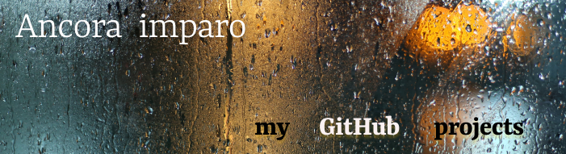

    
    # Hi there / Bonjour 👋   
     J'apprends actuellement le développement web à Campus Numerique in the Alps:  
     ✨ Contenu de la formation (non exhaustif):  
    • Gestion de projet (méthodologie Agile et méthode SCRUM) 
    • HTML / CSS et le framework Bootstrap  
    • UI  /  UX (Figma)  
    • Algorithmique  
    • Javascript - SPA (Vue.js)  
    • PHP / Bases de données (serveur WAMP, PHP framework Laravel, MySQL WorkBench, SQL)  
    • Java  
    • CMS (Wordpress)  
    • Réseaux et systèmes (protocole SSH et TCP/IP)  
    • Git, Github 
    • Anglais technique
    • Alternance en entreprise    
    
    

